# Figma Site Mapper - Complete Architecture & Functionality Diagram

## System Overview

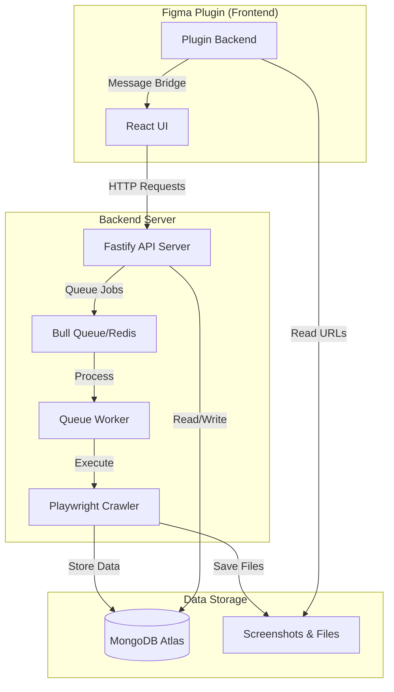

## Core Functionality Flow

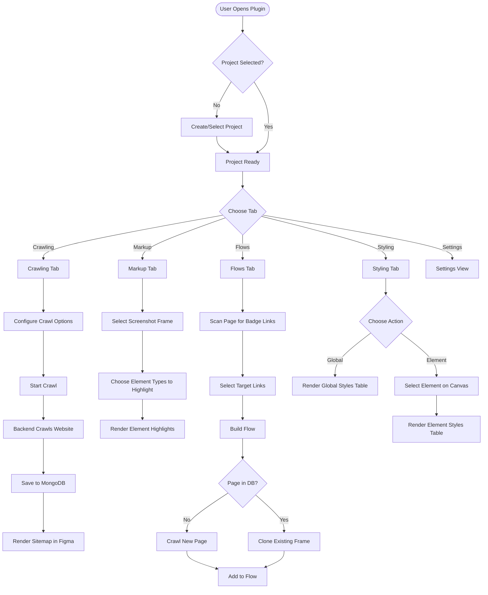

## Detailed Feature Map

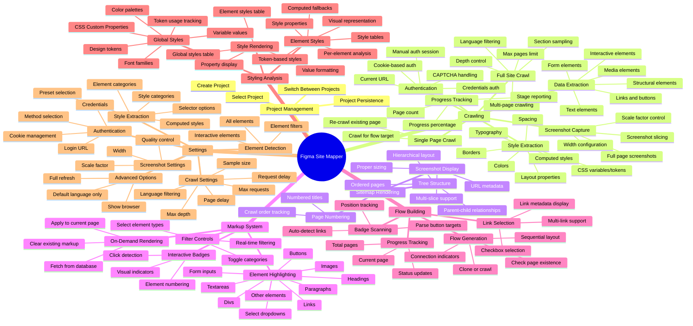

## Data Flow Architecture

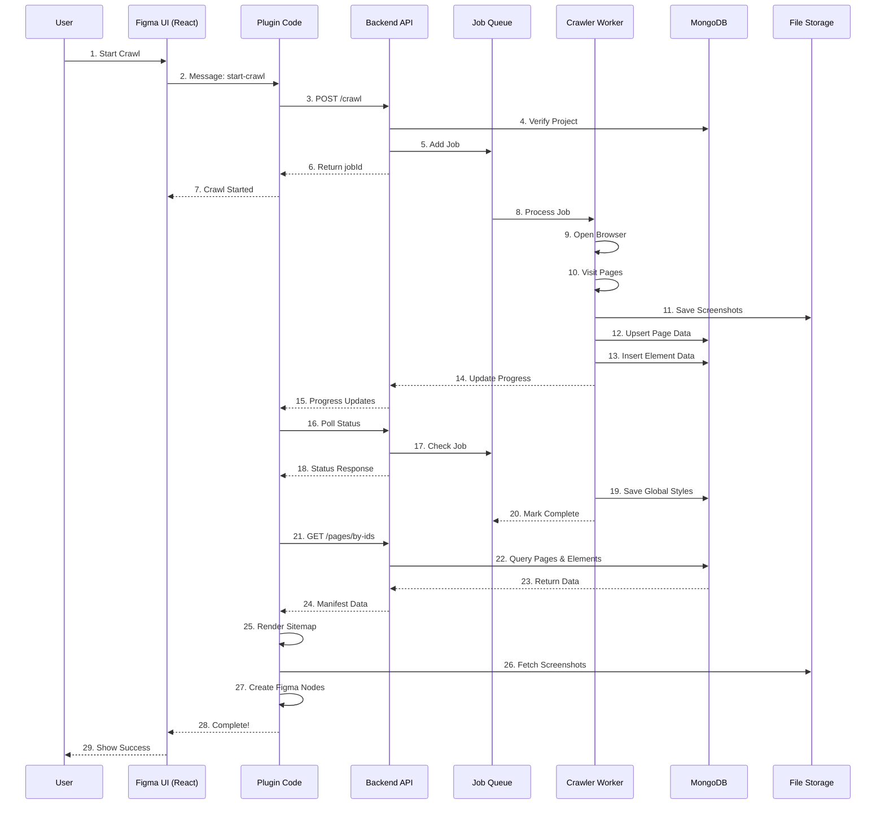

## Database Schema

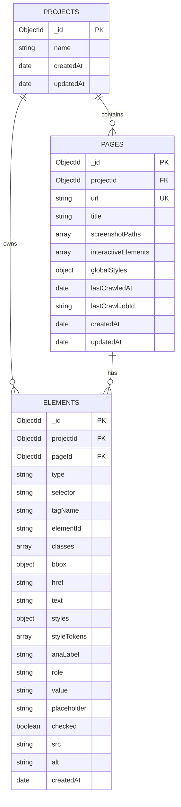

## Component Architecture (Plugin)

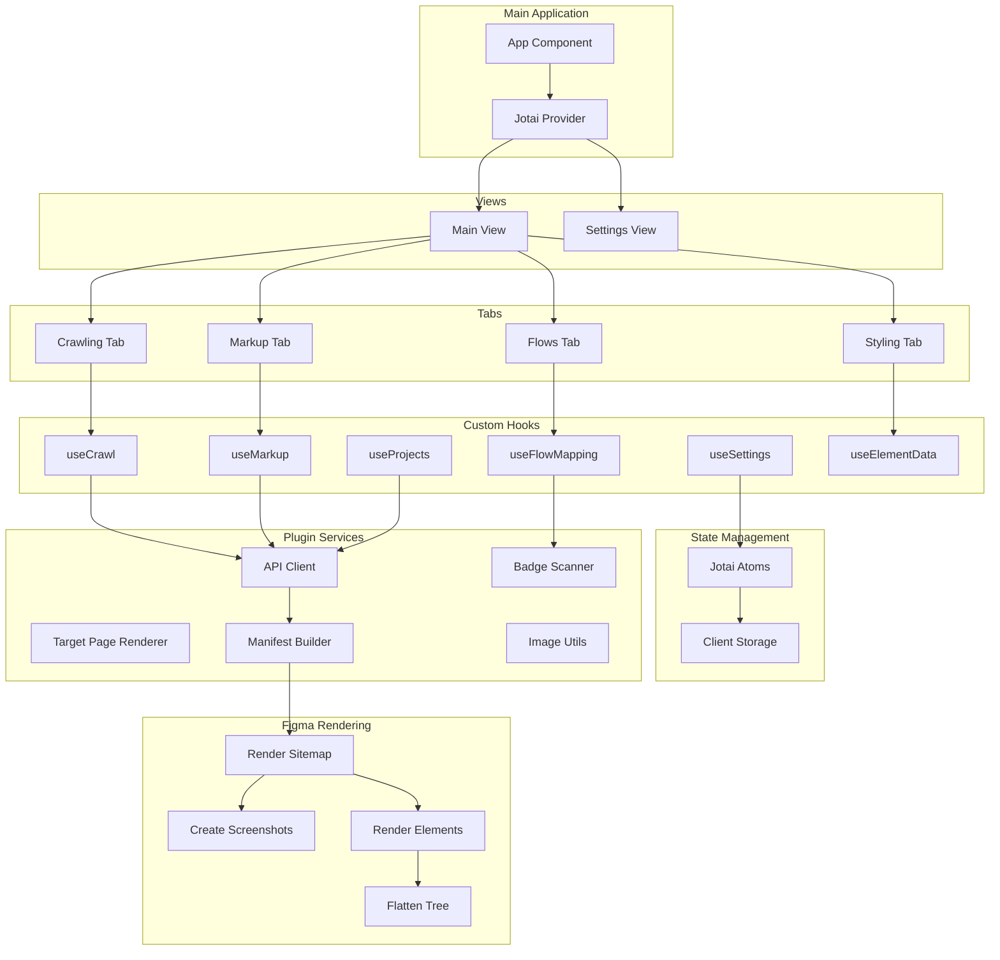

## Backend API Endpoints

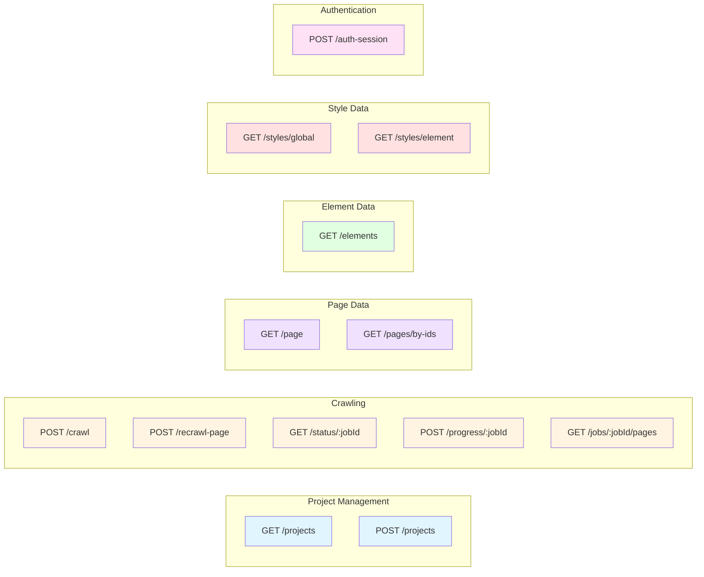

## Workflow Examples

### Full Crawl Workflow

```mermaid
flowchart TD
    Start([User Opens Plugin]) --> HasProject{Has Active Project?}
    HasProject -->|No| CreateProj[Create/Select Project]
    HasProject -->|Yes| ConfigCrawl[Configure Crawl Settings]
    CreateProj --> ConfigCrawl
    
    ConfigCrawl --> EnterURL[Enter Website URL]
    EnterURL --> SetOptions[Set Options:<br/>- Max Pages<br/>- Depth<br/>- Sample Size<br/>- Authentication]
    SetOptions --> StartCrawl[Click Start Crawl]
    
    StartCrawl --> Backend[Backend Processes]
    Backend --> BrowserOpen[Open Browser]
    BrowserOpen --> HandleAuth{Auth Required?}
    HandleAuth -->|Yes| AuthProcess[Handle Authentication]
    HandleAuth -->|No| StartNav[Start Navigation]
    AuthProcess --> StartNav
    
    StartNav --> VisitPage[Visit Page]
    VisitPage --> CheckCAPTCHA{CAPTCHA Detected?}
    CheckCAPTCHA -->|Yes| WaitSolve[Wait for Manual Solve]
    CheckCAPTCHA -->|No| ScrollPage[Scroll & Load Content]
    WaitSolve --> ScrollPage
    
    ScrollPage --> ExtractData[Extract:<br/>- Screenshot<br/>- Elements<br/>- Styles]
    ExtractData --> SaveDB[Save to MongoDB]
    SaveDB --> UpdateProgress[Update Progress]
    UpdateProgress --> MorePages{More Pages?}
    
    MorePages -->|Yes| VisitPage
    MorePages -->|No| BuildManifest[Build Manifest]
    
    BuildManifest --> RenderFigma[Render in Figma]
    RenderFigma --> CreatePages[Create Figma Pages]
    CreatePages --> AddScreenshots[Add Screenshots]
    AddScreenshots --> AddMetadata[Add Plugin Data]
    AddMetadata --> Done([Complete!])
```

### Flow Building Workflow

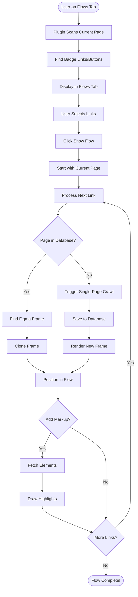

### Markup Workflow

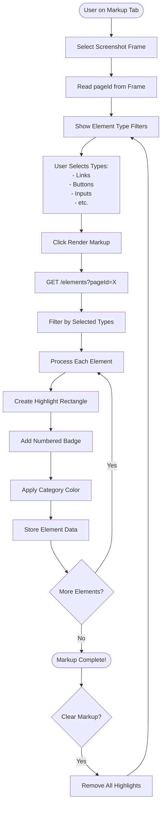

## Technology Stack

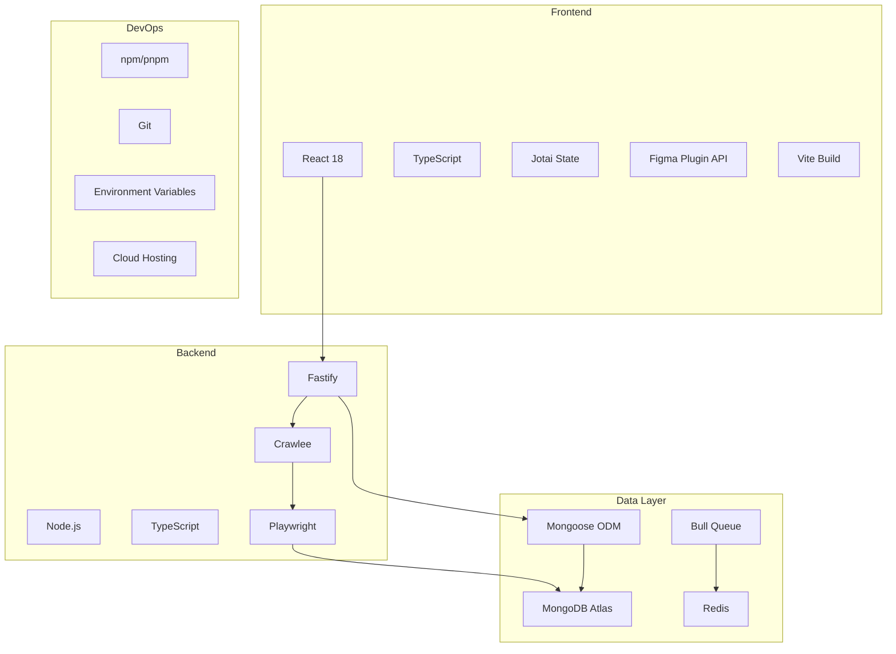

## Key Features Summary

| Category | Features |
|----------|----------|
| **Project Management** | Create projects, Select active project, Multi-project support, Project persistence |
| **Web Crawling** | Full site crawl, Single page crawl, Authentication support, CAPTCHA handling, Progress tracking, Language filtering, Section sampling, Depth control |
| **Data Extraction** | Screenshots with slicing, Interactive elements (links/buttons), Form elements, Text elements, Style data, CSS tokens, Computed styles |
| **Sitemap Generation** | Hierarchical tree structure, Auto-layout, Screenshot display, Page numbering, Metadata storage |
| **Element Markup** | On-demand highlighting, Multiple element types, Color-coded categories, Numbered badges, Filter controls, Clear functionality |
| **Flow Building** | Badge scanning, Link selection, Auto page detection, Clone or crawl, Sequential layout, Progress tracking |
| **Style Analysis** | Global styles extraction, CSS variables/tokens, Per-element styles, Color palettes, Typography data, Style tables |
| **Settings** | Screenshot configuration, Crawl limits, Authentication setup, Element filters, Style extraction presets, Advanced options |

## System Benefits

1. **Persistent Data**: MongoDB stores all crawled data permanently
2. **Reusability**: Pages crawled once can be reused across multiple flows
3. **Collaboration**: Multiple users can work on same project
4. **Incremental Updates**: Recrawl specific pages without full site crawl
5. **Style Token Tracking**: CSS variables and design tokens preserved
6. **Element-Level Analysis**: Detailed per-element styling information
7. **Flexible Markup**: On-demand element highlighting with filters
8. **Efficient Flows**: Clone existing pages instead of re-crawling
9. **Scalable Architecture**: Queue-based processing for concurrent crawls
10. **Rich Metadata**: Complete page and element data for analysis
