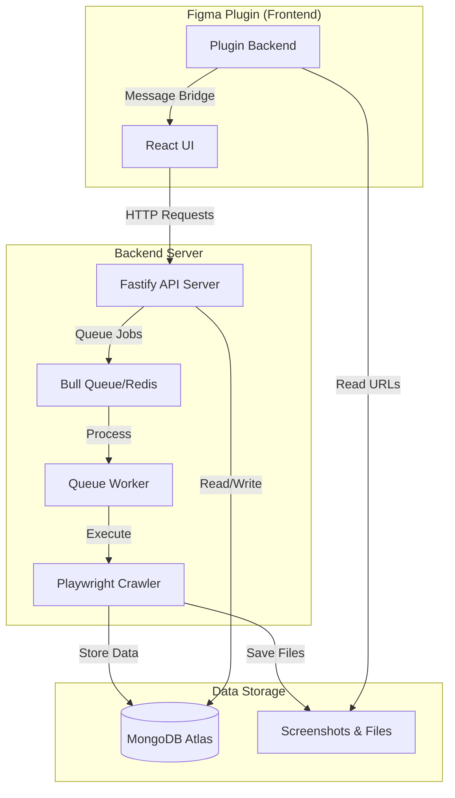

# Figma Site Mapper v0.1

Figma Site Mapper is a Figma plugin and crawling backend that captures website screenshots and renders visual sitemaps directly inside Figma. This repository contains the backend crawler (API + worker) and the Figma plugin UI which coordinates crawls and renders the results as Figma pages.

This README is intentionally concise and focuses on the current, supported features in v0.1.

## What’s included (v0.1)

- Backend crawler (Playwright/Crawlee) responsible for fetching pages, capturing screenshots, and extracting structural & styling information
- REST API server for submitting crawl jobs and checking status (`packages/backend`)
- Figma plugin (React) that:
  - Starts crawls and shows progress
  - Renders sitemap pages inside Figma from crawl manifests
  - Styling tab: creates a dedicated styling page for the current Figma page and highlights detected elements (single-page crawl)

## Styling tab (current behavior)

When you open the plugin's Styling tab, the UI queries the current Figma page for plugin metadata (the crawl URL saved on pages created by the renderer). If the page has no URL, the Styling tab shows a message and the highlight button is disabled.

If the current page has a stored URL, the "🎨 Highlight Current Page" button becomes available. Clicking it does the following:

1. Reads the URL from the current page's plugin data (`figma.currentPage.getPluginData("URL")`).
2. Creates a new Figma page right after the current page with the name prefixed by "🎨 ".
3. Sends a single-page crawl job (max requests = 1) to the backend for that URL. The crawl runs with element detection enabled.
4. When the crawl completes, the plugin renders the screenshot(s) and overlays color-coded highlights for all detected elements on the generated styling page (headings, links, buttons, form inputs, textareas, selects, images, paragraphs, divs, other).

Notes:

- The styling page uses a single-page crawl, so it only requests the specific page URL assigned to the Figma page.
- Highlights are color-coded by element type and include small badges for interactive elements (links/buttons).

## Quickstart (dev)

Requirements:

- Node.js 18+ and pnpm
- Figma Desktop App (for plugin development)
- Redis (optional for queueing in some dev setups)

Install and run:

```bash
git clone https://github.com/chillyweather/figma-site-mapper.git
cd figma-site-mapper
pnpm install

# Run both backend and plugin dev servers
pnpm dev
```

This will run the backend at `http://localhost:3006` and start the plugin dev watcher.

To run only the plugin or backend individually:

```bash
pnpm dev:plugin   # run only the plugin dev server
pnpm dev:backend  # run only the backend server
```

## Figma plugin (load for development)

1. Open Figma Desktop
2. Menu → Plugins → Development → Import plugin from manifest
3. Choose `packages/plugin/manifest.json`
4. Run the plugin from the Plugins menu

## Architecture

For a complete overview of the system architecture and all features, see the [Architecture Diagram](./ARCHITECTURE_DIAGRAM.md).

### System Overview



### Core Features

- **Project Management**: Create and manage multiple website projects
- **Web Crawling**: Full-site and single-page crawling with authentication support
- **Element Extraction**: Automatic detection of links, buttons, forms, and other interactive elements
- **Style Analysis**: Extract CSS variables, design tokens, and computed styles
- **Sitemap Generation**: Hierarchical tree visualization in Figma
- **Markup System**: On-demand element highlighting with type filters
- **Flow Building**: Create user flow diagrams by connecting pages
- **Persistent Storage**: All data saved to MongoDB for reuse and collaboration

## Notes for contributors

- The repo is split into `packages/backend` and `packages/plugin`. Keep plugin-facing changes inside `packages/plugin` and backend logic inside `packages/backend`.
- The plugin communicates with the backend via HTTP messages. The UI sends crawl requests and polls job status; when a manifest is available, the plugin fetches it and renders Figma pages.
- Styling highlights are rendered using `renderTargetPage` and the element highlight overlay helpers in the plugin backend.

## License

ISC
