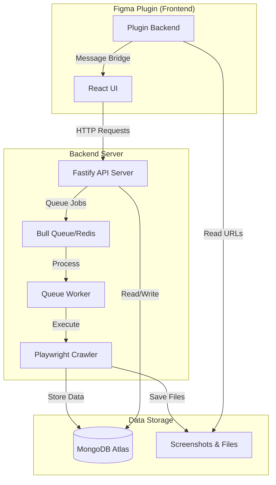

# Figma Site Mapper

Figma Site Mapper is a comprehensive tool that captures website screenshots and renders visual sitemaps directly in Figma. It combines a backend crawler (built on Playwright/Crawlee) with a Figma plugin UI to help designers and developers understand website structure, analyze styling, and create user flow diagrams.

**Repository Structure**: `packages/backend` (API + crawler worker) and `packages/plugin` (React UI).

> For a complete overview of the system architecture, features, and workflows, see the [Architecture Diagram](./ARCHITECTURE_DIAGRAM.md).

## Core Components

### Backend (`packages/backend`)
- **Crawling Engine**: Playwright/Crawlee-based crawler for multi-page website crawling with authentication and progress tracking
- **REST API**: Fastify server for managing crawl jobs and data queries
- **Job Queue**: Bull queue with Redis for handling concurrent crawls
- **Database Models**: MongoDB schemas for Projects, Pages, and Elements

### Figma Plugin (`packages/plugin`)
- **Project Management**: Create and manage multiple website projects
- **Crawling Tab**: Submit and monitor crawl jobs with progress tracking
- **Sitemap Rendering**: Render hierarchical page structures with screenshots
- **Markup Tab**: Highlight detected elements on screenshots with color-coded categories
- **Flow Building**: Create user flows by connecting pages and scanning for navigation links
- **Styling Tab**: Analyze and highlight design tokens, CSS variables, and element-level styles

## Key Workflows

### Styling Tab (Highlight Current Page)

When you open the plugin's Styling tab, the UI queries the current Figma page for plugin metadata (the crawl URL saved on pages created by the renderer). If the page has no URL, the Styling tab shows a message and the highlight button is disabled.

If the current page has a stored URL, the "🎨 Highlight Current Page" button becomes available. Clicking it does the following:

1. Reads the URL from the current page's plugin data (`figma.currentPage.getPluginData("URL")`)
2. Creates a new Figma page right after the current page with the name prefixed by "🎨 "
3. Sends a single-page crawl job (max requests = 1) to the backend for that URL with element detection enabled
4. When the crawl completes, renders the screenshot(s) and overlays color-coded highlights for all detected elements (headings, links, buttons, form inputs, textareas, selects, images, paragraphs, divs, other)

**Details**:
- The styling page uses a single-page crawl, so it only requests the specific page URL
- Highlights are color-coded by element type and include small badges for interactive elements

## Getting Started (Development)

### Requirements

- Node.js 18+ and pnpm
- Figma Desktop App (for plugin development)
- MongoDB Atlas credentials (or local MongoDB)
- Redis (optional for queueing in some dev setups)

### Installation & Setup

```bash
git clone https://github.com/chillyweather/figma-site-mapper.git
cd figma-site-mapper
pnpm install

# Configure environment variables
# Copy .env.example to .env in packages/backend and fill in your values
```

### Running Locally

```bash
# Run both backend and plugin dev servers
pnpm dev
```

This will run the backend at `http://localhost:3006` and start the plugin dev watcher.

To run only the plugin or backend individually:

```bash
pnpm dev:plugin   # run only the plugin dev server
pnpm dev:backend  # run only the backend server
```

### Load Plugin in Figma

1. Open Figma Desktop
2. Menu → Plugins → Development → Import plugin from manifest
3. Choose `packages/plugin/manifest.json`
4. Run the plugin from the Plugins menu

## Architecture Overview



## Features

- **Project Management**: Create and manage multiple website projects with persistent data
- **Web Crawling**: Full-site and single-page crawling with authentication support, CAPTCHA handling, and configurable limits
- **Element Extraction**: Automatic detection of links, buttons, forms, images, and other interactive elements
- **Style Analysis**: Extract CSS custom properties, design tokens, computed styles, colors, and typography
- **Sitemap Generation**: Hierarchical tree visualization with screenshots and metadata in Figma
- **Markup System**: On-demand element highlighting with type filters and color-coded categories
- **Flow Building**: Create user flow diagrams by connecting pages and scanning for navigation links
- **Persistent Storage**: All data saved to MongoDB for reuse and collaboration

## Development Notes

- The repo is split into `packages/backend` and `packages/plugin`. Keep plugin-facing changes in `packages/plugin` and backend logic in `packages/backend`
- The plugin communicates with the backend via HTTP messages. The UI sends crawl requests and polls job status
- When a manifest is available, the plugin fetches it and renders Figma pages
- Styling highlights are rendered using `renderTargetPage` and element highlight overlay helpers in the plugin backend

## For More Information

- **Complete Architecture**: See [Architecture Diagram](./ARCHITECTURE_DIAGRAM.md) for detailed system design, database schemas, component architecture, and workflow examples
- **Plugin Architecture**: See [ARCHITECTURE.md](./packages/plugin/ARCHITECTURE.md) in the plugin package
- **Requirements**: See [REQUIREMENTS.md](./REQUIREMENTS.md) for feature specifications

## License

ISC
