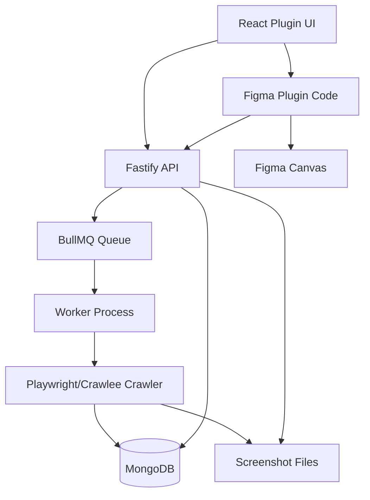

# Architecture

Figma Site Mapper has two main runtime surfaces:

- A backend service that crawls websites, stores crawl results, and serves data to the plugin.
- A Figma plugin that provides the UI and renders crawl results onto the Figma canvas.

## System Overview

## Backend

The backend lives in `packages/backend`.

Main modules:

- `src/index.ts`: starts the Fastify server after connecting to MongoDB.
- `src/app.ts`: defines API routes.
- `src/queue.ts`: creates the BullMQ queue.
- `src/worker.ts`: consumes crawl jobs and calls the crawler.
- `src/crawler.ts`: runs Playwright/Crawlee, captures screenshots, extracts data, and persists results.
- `src/models/*`: Mongoose models for projects, pages, and elements.
- `src/services/manifestBuilder.ts`: builds page/element payloads from persisted records.

Important API endpoints:

- `GET /projects`
- `POST /projects`
- `POST /crawl`
- `POST /recrawl-page`
- `GET /status/:jobId`
- `GET /jobs/:jobId/pages`
- `GET /pages/by-ids`
- `GET /page`
- `GET /elements`
- `GET /styles/global`
- `GET /styles/element`
- `POST /auth-session`

## Data Model

The DB-backed model replaced the earlier manifest-file approach.

`Project`

- `name`
- timestamps

`Page`

- `projectId`
- `url`
- `title`
- `screenshotPaths`
- `interactiveElements`
- `globalStyles`
- `lastCrawledAt`
- `lastCrawlJobId`

`Element`

- `projectId`
- `pageId`
- `type`
- `selector`
- `tagName`
- `elementId`
- `classes`
- `bbox`
- `href`
- `text`
- `styles`
- `styleTokens`
- accessibility and media/input metadata

`Page` has a unique compound index on `projectId + url`, so a recrawl updates the same logical page.

## Crawl Flow

1. The plugin sends `POST /crawl` with URL, project ID, and crawl settings.
2. The API validates the project and queues a BullMQ job.
3. The worker pulls the job and calls `runCrawler`.
4. The crawler opens Chromium, navigates pages, handles delays/auth/CAPTCHA checks, scrolls for lazy loading, and captures screenshots.
5. Screenshots are sliced and written to the local screenshot directory.
6. Page data is upserted into MongoDB.
7. Existing elements for that page are deleted and replaced with fresh extracted elements.
8. The worker writes visited page IDs and URLs back to the job.
9. The plugin polls `/status/:jobId`, then fetches only the visited pages when possible.
10. The plugin renders Figma pages and stores DB IDs in Figma plugin data.

## Plugin

The plugin lives in `packages/plugin`.

Main areas:

- `src/ui.tsx`: React entry point.
- `src/main.ts`: Figma plugin entry point.
- `src/components/*`: UI views and tabs.
- `src/hooks/*`: UI-side state/workflows.
- `src/store/atoms.ts`: Jotai state.
- `src/plugin/handlers/*`: Figma-side message handlers.
- `src/plugin/services/*`: backend API client, badge scanning, target page rendering.
- `src/figmaRendering/*`: sitemap/screenshot rendering helpers.

The UI has four main tabs:

- Crawling
- Markup
- Flows
- Styling

The Figma-side code stores metadata on generated pages and nodes using plugin data keys such as `URL`, `PAGE_ID`, `SCREENSHOT_WIDTH`, and element IDs. That metadata is the bridge between Figma canvas objects and MongoDB records.

## Rendering Flow

Automatic rendering after crawl:

1. Poll job status until complete.
2. Read `visitedPageIds` from the completed job.
3. Build a manifest-like tree from those pages.
4. Render screenshot pages and an index page.
5. Store project/page metadata in Figma plugin data.

Snapshot rendering:

1. Fetch all project pages and elements.
2. Rebuild a full sitemap from persisted DB records.
3. Render the full project into Figma.

Markup rendering:

1. Read `PAGE_ID` from the active generated Figma page.
2. Fetch elements for that page.
3. Filter by requested element categories.
4. Draw highlight rectangles and badges in the `Page Overlay` frame.

Flow rendering:

1. Scan badges/links from the current Figma page.
2. User selects a link.
3. Plugin checks whether the target page exists in MongoDB.
4. If it exists, render from DB.
5. If not, queue a single-page recrawl and render the result.

## Known Architecture Gaps

- `BACKEND_URL` is currently compiled into the plugin and defaults to `http://localhost:3006`.
- Redis connection currently uses default local settings instead of `REDIS_URL`.
- Screenshot storage is local in the current code. Some older notes mention S3/object storage, but that is not reflected in the current crawler.
- There is no formal auth/rate-limit layer on the API.
- The styling tab workflow exists but needs a fresh validation pass.
